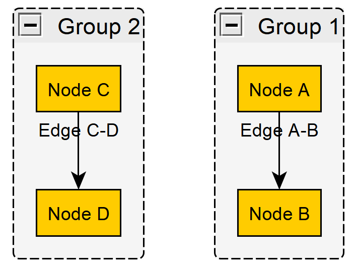
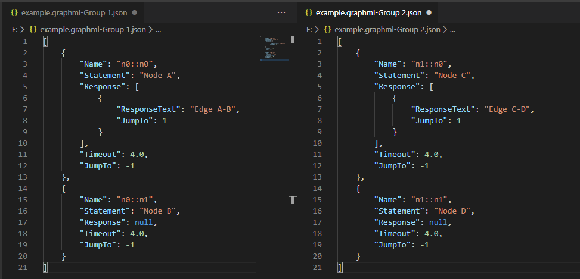
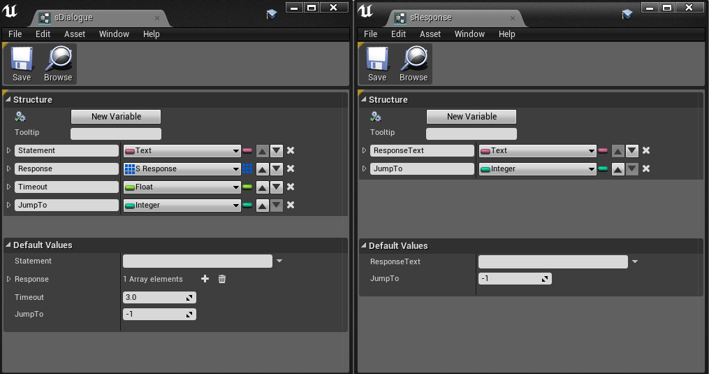

# XMLtoUE4JsonDataTable-Dialogue
Converts yEd's .graphml xml files to UE4-importable Json

## --Please note that this program is designed for my own workflow. It's more like a starting point for others to modify it to process data suited to their specific use case--

## Compatibility

My use case is:
  - yEd 3.19
  - UE 4.22, 4.24
  
It should work with any UE4 version as long as they don't change the behaviour of UStructures / DataTables

It should work with any yEd version as long as they don't change the Hierarchy/Structure of their .graphml XML savefile

If it breaks at the parsing the XML (graphml), try regenerating the XML class from your version's savefile. There's a Command line tool shipping with Visual Studio that can do that

## In yEd Graph Editor:

## In the program:

  You drag-drop files from explorer
  
  Doubleclick to remove entry

## Result:

  The converted Json can be imported to ue4 (drag-drop) as a data-table asset of sDialogue structure
  
## The sDialogue and sResponse structures:

## Explicit start functionality

  If you make your start node a down-pointing triangle, the program will try to make that node the first statement in the json file and also switch its name to n*::n0 where n* is its original group id
  
  This is useful if for some ungodly reason yEd decides that it wants to shuffle the order of nodes or if you didn't start building your graph with the root
