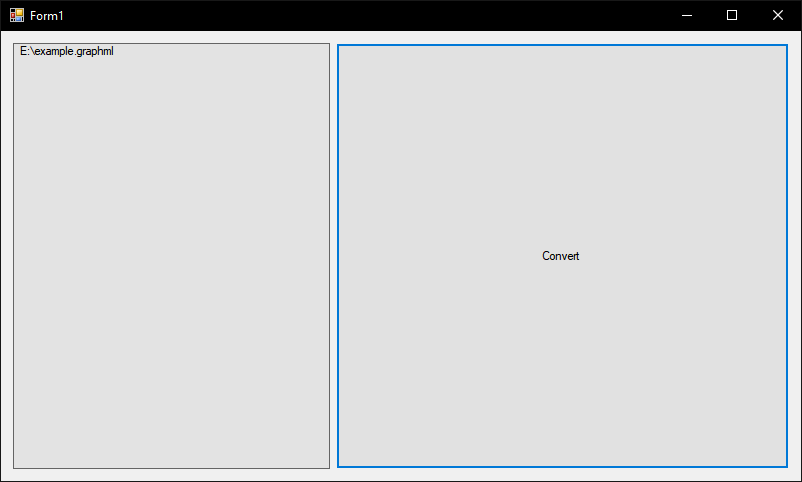

# XMLtoUE4JsonDataTable-Dialogue
Converts yEd's .graphml xml files to UE4-importable Json

## In yEd Graph Editor:

## In the program:

  You drag-drop files from explorer
  
  Doubleclick to remove entry

## Result:

  The converted Json can be imported to ue4 (drag-drop) as a data-table asset of sDialogue structure
  
## The sDialogue and sResponse structures:

